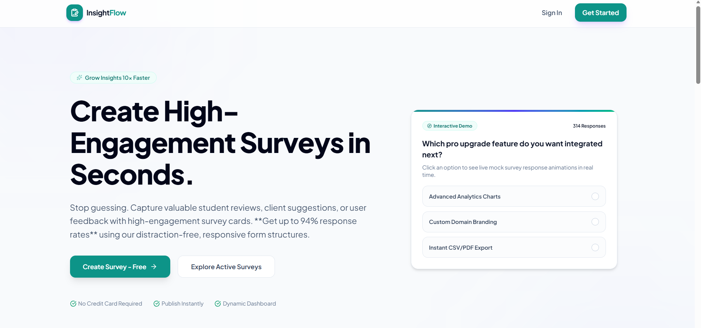
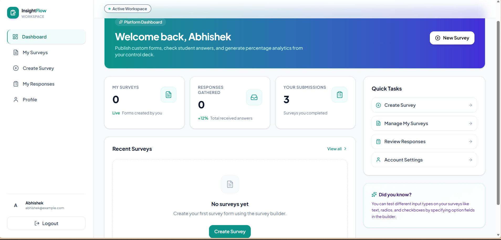
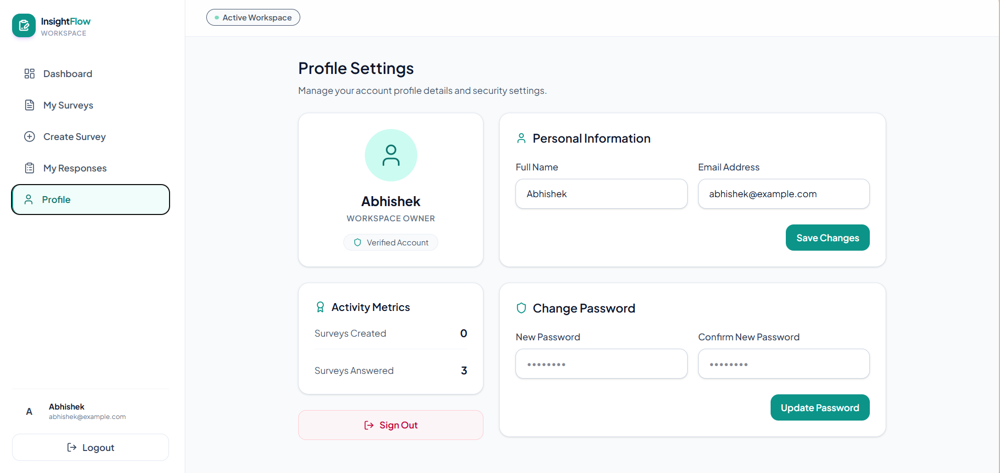
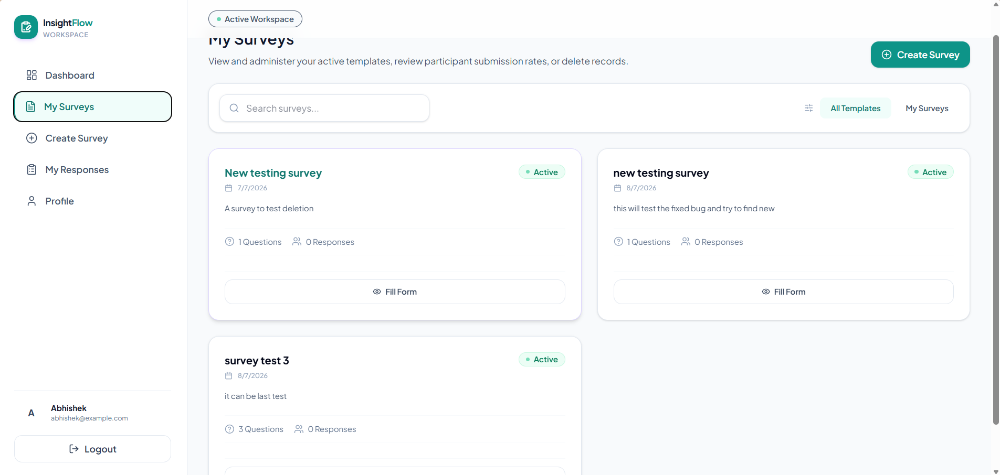
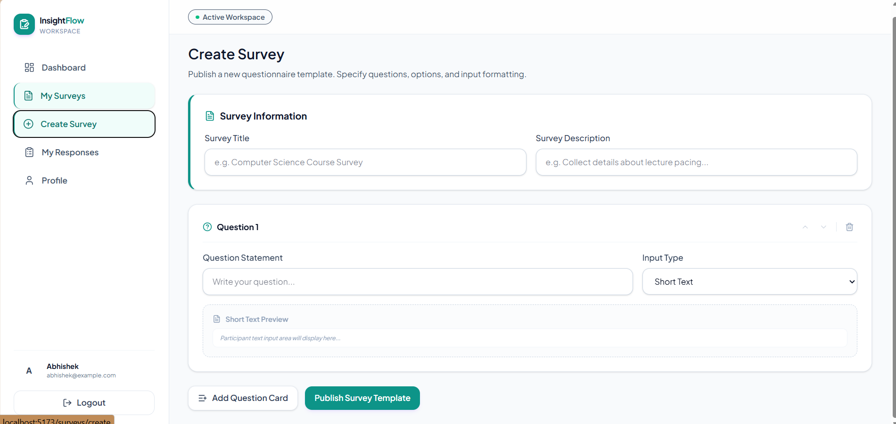
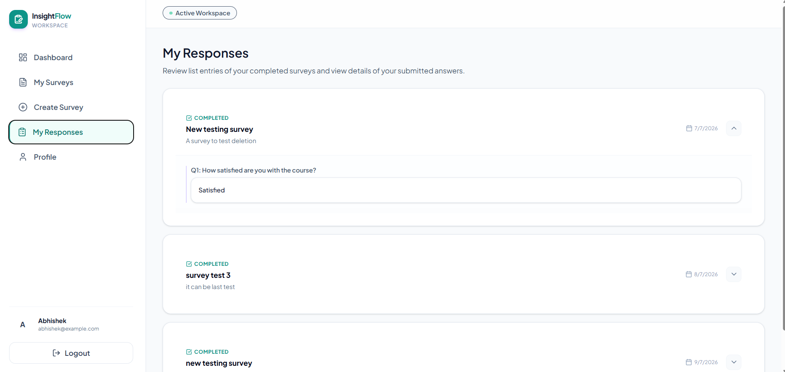

# Survey Platform

A full-stack survey management application built using the MERN stack. The platform allows users to create surveys, participate in surveys, manage survey data, submit responses, and review collected results through a clean and responsive interface.

## Features

- User registration and login
- JWT-based authentication
- Protected routes
- Create surveys dynamically
- Add text and multiple-choice questions
- Browse available surveys
- Submit survey responses
- View previously submitted responses
- View survey results
- Edit and delete surveys
- Responsive user interface
- Centralised API service layer
- Loading, error, and empty states

## Tech Stack

### Frontend

- React
- React Router
- Vite
- Tailwind CSS
- JavaScript

### Backend

- Node.js
- Express.js
- MongoDB
- Mongoose

### Authentication

- JSON Web Tokens (JWT)
- bcrypt

## Project Structure

```text
Survey-Platform/
│
├── client/
│   ├── src/
│   │   ├── assets/
│   │   ├── components/
│   │   ├── context/
│   │   ├── layouts/
│   │   ├── pages/
│   │   ├── routes/
│   │   ├── services/
│   │   ├── App.jsx
│   │   ├── index.css
│   │   └── main.jsx
│   │
│   ├── index.html
│   ├── package.json
│   └── vite.config.js
│
├── docs/
│
├── server/
│   ├── src/
│   │   ├── config/
│   │   ├── controllers/
│   │   ├── middleware/
│   │   ├── models/
│   │   ├── routes/
│   │   ├── utils/
│   │   ├── app.js
│   │   └── server.js
│   │
│   ├── package.json
│   └── package-lock.json
│
└── .gitignore
```
# 🚀 Getting Started

Follow the steps below to set up and run the **Survey Platform** locally.

---

## 📋 Prerequisites

Make sure the following tools are installed on your system:

- **Node.js**
- **npm**
- **MongoDB** or a **MongoDB Atlas account**
- **Git**

---

## ⚙️ Installation

### 1. Clone the Repository

Clone the project using Git:

```bash
git clone https://github.com/abhirana-ai/Survey-Platform
```

Move into the project directory:

```bash
cd Survey-Platform
```

---

### 2. Install Backend Dependencies

Move into the `server` directory:

```bash
cd server
```

Install the required dependencies:

```bash
npm install
```

---

### 3. Configure Environment Variables

Create a `.env` file inside the `server` directory.

Add the following environment variables:

```env
PORT=5000
MONGODB_URI=your_mongodb_connection_string
JWT_SECRET=your_jwt_secret
JWT_EXPIRES_IN=7d
```

Replace the placeholder values with your own configuration.

> ⚠️ **Important:** Never commit your `.env` file or expose sensitive credentials in the repository.

---

### 4. Start the Backend Server

For development:

```bash
npm run dev
```

For production:

```bash
npm start
```

---

### 5. Install Frontend Dependencies

Open another terminal and move into the `client` directory:

```bash
cd client
```

Install the required dependencies:

```bash
npm install
```

---

### 6. Start the Frontend

Run the Vite development server:

```bash
npm run dev
```

The terminal will display the local URL where the application is running.

---

# 📜 Available Scripts

## 💻 Frontend

### Start the Development Server

```bash
npm run dev
```

Starts the **Vite development server**.

### Create a Production Build

```bash
npm run build
```

Creates an optimised production build of the frontend.

### Preview the Production Build

```bash
npm run preview
```

Runs the production build locally for previewing.

---

## 🖥️ Backend

### Start the Development Server

```bash
npm run dev
```

Starts the backend development server using **Nodemon**.

### Start the Production Server

```bash
npm start
```

Starts the backend server using **Node.js**.

---

# 🔄 Application Workflow

The Survey Platform follows this general workflow:

1. A user creates an account or signs in.
2. The server authenticates the user and generates a JWT.
3. Authenticated users can access protected application routes.
4. Users can create surveys containing text and multiple-choice questions.
5. Users can browse available surveys and submit responses.
6. Submitted responses are stored in MongoDB.
7. Users can review their previously submitted responses.
8. Survey creators can manage their surveys and review collected results.

---

# 🔐 Authentication

The application uses **JWT-based authentication**.

After a successful login, the server generates a **JSON Web Token (JWT)** that is used to authenticate protected API requests.

Protected requests use the following header format:

```text
Authorization: Bearer <token>
```

The default token lifetime is:

```text
7d
```

---

# 🔌 API Overview

The backend provides API routes for:

- 👤 User registration
- 🔑 User login
- ➕ Survey creation
- 📋 Survey retrieval
- ✏️ Survey updates
- 🗑️ Survey deletion
- 📨 Response submission
- 📁 User response retrieval
- 📊 Survey result retrieval

---

# 📸 Screenshots

## Landing Page



## Dashboard



## Profile



## Survey Management



## Create Survey



## Submitted Responses



---

# 🔮 Future Improvements

Possible future improvements include:

- 📊 Advanced survey analytics
- ❓ Additional question types
- 📈 Improved data visualisation
- 🔍 Survey search and filtering
- 👤 User profile management
- 🔗 Survey sharing functionality
- 📱 Improved mobile experience
- ♿ Enhanced accessibility
- ☁️ Deployment and production configuration

---

# 🛡️ Security

The application follows several security practices:

- 🔒 Passwords are hashed before being stored.
- 🔑 Authentication is handled using JSON Web Tokens.
- 🛡️ Protected backend routes require valid authentication.
- ⚙️ Environment variables are used for sensitive configuration.
- 🚫 User credentials and secrets are not committed to the repository.

---

# 👨‍💻 Author

## Abhishek Rana

**B.Tech Computer Science and Engineering Student**
